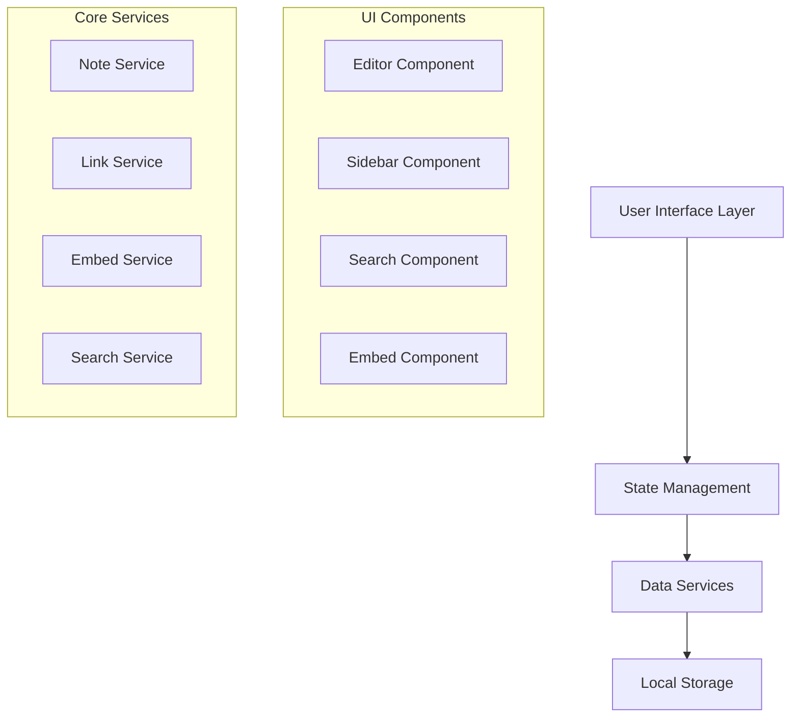

# Design Document

## Overview

The Web Note App is a single-page application (SPA) built with modern web technologies that operates entirely within the browser. The application uses a component-based architecture with local storage for data persistence, providing a rich text editing experience with bi-directional linking, smart embeds, and hierarchical organization.

## Architecture

### High-Level Architecture



### Technology Stack

- **Frontend Framework**: React with TypeScript for type safety and component reusability
- **Text Editor**: Draft.js or Slate.js for rich text editing with plugin architecture
- **State Management**: Zustand for lightweight, reactive state management
- **Storage**: IndexedDB with Dexie.js wrapper for structured local data storage
- **Styling**: CSS Modules with CSS Grid/Flexbox for responsive layout
- **Drag & Drop**: React DnD for sophisticated drag-and-drop interactions
- **Search**: Fuse.js for fuzzy search capabilities
- **Link Preview**: Custom service using CORS proxy or browser APIs where available

## Components and Interfaces

### Core Components

#### 1. App Component
- Root component managing global state and routing
- Handles keyboard shortcuts (Ctrl+B, Ctrl+I, Ctrl+K)
- Manages autosave debouncing (2-second delay)

#### 2. Sidebar Component
```typescript
interface SidebarProps {
  notes: Note[];
  selectedNoteId: string | null;
  onNoteSelect: (noteId: string) => void;
  onNoteReorder: (draggedId: string, targetId: string, position: 'before' | 'after' | 'child') => void;
}
```

Features:
- Hierarchical tree view with up to 2 levels of nesting
- Drag-and-drop reordering and nesting
- Visual feedback during drag operations
- Collapsible parent notes

#### 3. Editor Component
```typescript
interface EditorProps {
  note: Note | null;
  onChange: (content: EditorState) => void;
  onLinkCreate: (text: string, url?: string) => void;
}
```

Features:
- Rich text editing with Markdown support
- Real-time formatting preview
- Image paste handling
- Link creation with Ctrl+K
- Bi-directional link detection and creation

#### 4. Search Component
```typescript
interface SearchProps {
  onSearch: (query: string) => void;
  results: SearchResult[];
  onResultSelect: (noteId: string) => void;
}
```

Features:
- Real-time search across all note content
- Highlighted search terms in results
- Context snippets for each result

#### 5. Smart Embed Component
```typescript
interface SmartEmbedProps {
  url: string;
  metadata?: LinkMetadata;
  onLoad: (metadata: LinkMetadata) => void;
}
```

Features:
- Automatic URL detection and preview generation
- Fallback handling for failed metadata extraction
- Responsive design within 3-line height constraint

### Data Models

#### Note Model
```typescript
interface Note {
  id: string;
  title: string;
  content: EditorState; // Draft.js editor state
  createdAt: Date;
  updatedAt: Date;
  parentId?: string;
  order: number;
  links: {
    outbound: string[]; // IDs of notes this note links to
    inbound: string[];  // IDs of notes that link to this note
  };
  embeds: LinkEmbed[];
}
```

#### Link Embed Model
```typescript
interface LinkEmbed {
  id: string;
  url: string;
  title?: string;
  description?: string;
  image?: string;
  favicon?: string;
  siteName?: string;
}
```

#### Search Result Model
```typescript
interface SearchResult {
  noteId: string;
  title: string;
  snippet: string;
  matches: {
    start: number;
    end: number;
  }[];
}
```

## Data Services

### Note Service
- CRUD operations for notes
- Hierarchical relationship management
- Link relationship tracking
- Autosave with debouncing

### Link Service
- Bi-directional link creation and maintenance
- Link integrity validation
- Backlink computation

### Embed Service
- URL metadata extraction
- Caching of embed data
- Fallback handling for CORS restrictions

### Search Service
- Full-text indexing of note content
- Fuzzy search implementation
- Result ranking and highlighting

### Storage Service
- IndexedDB operations with Dexie.js
- Data migration handling
- Export/import functionality
- Abstract storage interface for future cloud migration
- Sync conflict resolution preparation

## Error Handling

### Storage Errors
- Graceful degradation when IndexedDB is unavailable
- Fallback to localStorage with reduced functionality
- User notification for storage quota exceeded

### Network Errors (for embeds)
- Timeout handling for slow metadata requests
- Fallback to basic URL display when metadata fails
- Retry mechanism with exponential backoff

### Editor Errors
- Undo/redo functionality for accidental changes
- Content recovery from autosave
- Validation for malformed content

### Drag & Drop Errors
- Prevention of invalid nesting (beyond 2 levels)
- Rollback for failed drag operations
- Visual feedback for invalid drop targets

## Testing Strategy

### Unit Tests
- Component rendering and prop handling
- Service layer business logic
- Data model validation
- Utility function correctness

### Integration Tests
- Editor and storage integration
- Search functionality across components
- Drag-and-drop workflow
- Link creation and bi-directional updates

### End-to-End Tests
- Complete note creation and editing workflow
- Hierarchical organization scenarios
- Search and navigation flows
- Autosave and recovery scenarios

### Performance Tests
- Large note collection handling (1000+ notes)
- Search performance with extensive content
- Memory usage monitoring
- Startup time optimization

## Security Considerations

### XSS Prevention
- Content sanitization for rich text
- Safe HTML rendering for embeds
- Input validation for all user content

### Data Privacy
- Local-only storage (no external servers)
- No tracking or analytics
- User control over data export/deletion

## Accessibility

### Keyboard Navigation
- Full keyboard accessibility for all features
- Screen reader compatibility
- Focus management for dynamic content

### Visual Design
- High contrast mode support
- Scalable text and UI elements
- Color-blind friendly design choices

## Performance Optimization

### Rendering
- Virtual scrolling for large note lists
- Lazy loading of note content
- Debounced search and autosave

### Storage
- Efficient indexing strategies
- Incremental backup/sync
- Memory management for large datasets

### Bundle Size
- Code splitting for feature modules
- Tree shaking for unused dependencies
- Optimized asset loading

## Future Migration Considerations

### Cloud Migration Path
- Abstract storage interface (IStorageService) to enable backend swapping
- Data serialization format compatible with JSON APIs
- Conflict resolution strategies for multi-device sync
- Incremental sync capabilities with change tracking
- Authentication integration points for user accounts

### Multi-Device Sync Preparation
- UUID-based note IDs for global uniqueness
- Timestamp-based conflict resolution
- Delta sync for efficient bandwidth usage
- Offline-first architecture maintained